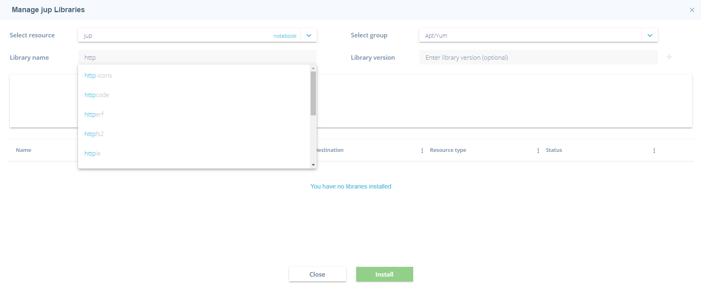
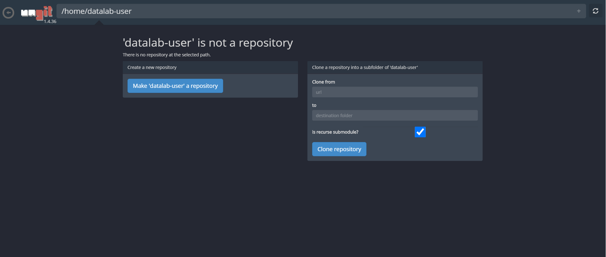
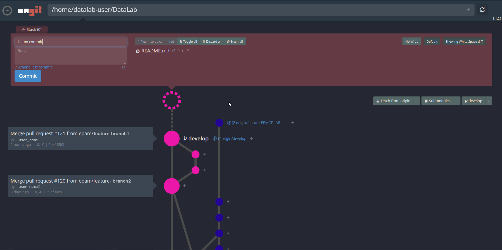
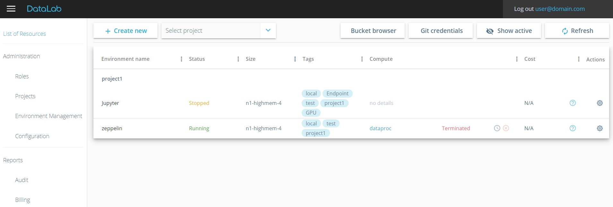
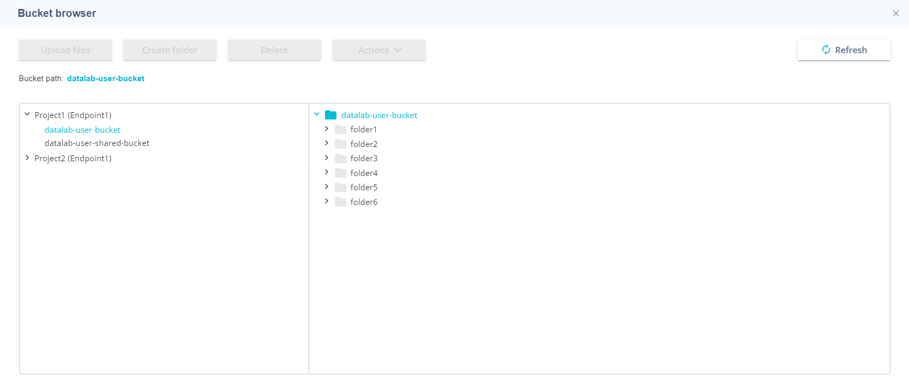
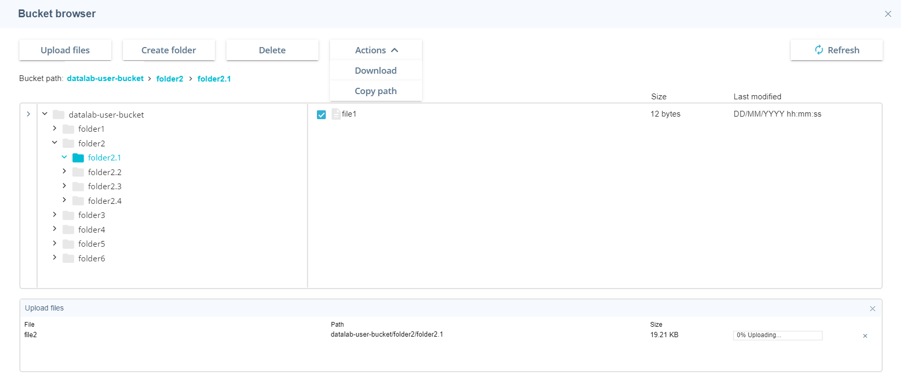
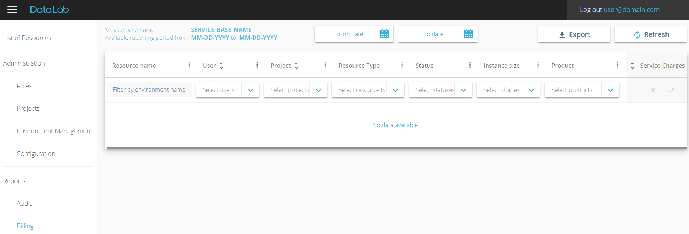
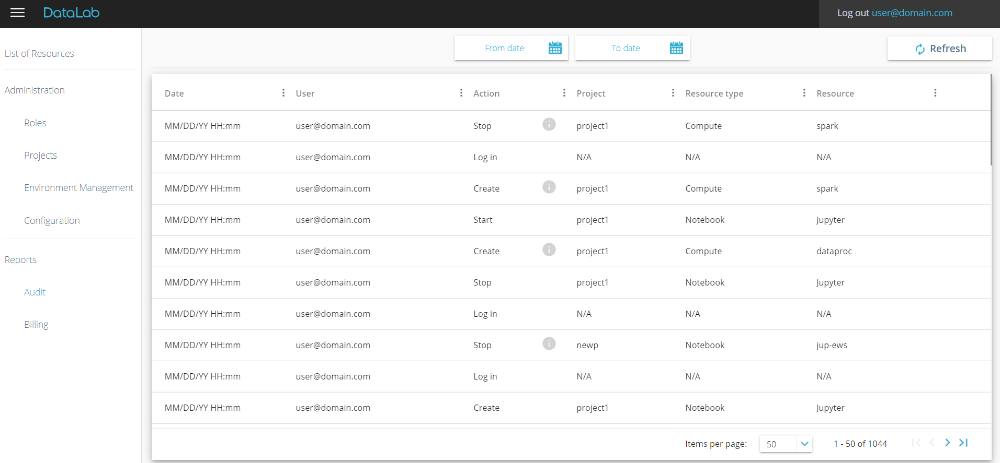
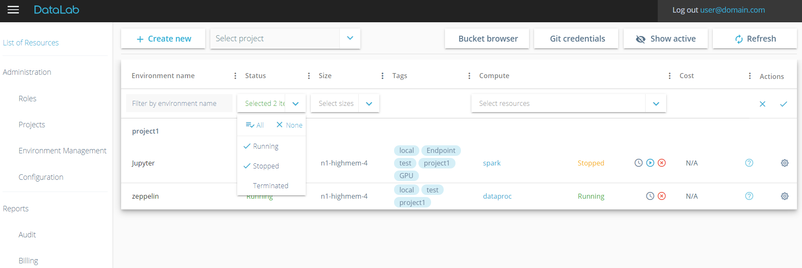

What is DataLab?
=============

DataLab is an essential toolset for analytics. It is a self-service Web Console, used to create and manage exploratory environments. It allows teams to spin up analytical environments with best of breed open-source tools just with a single click of the mouse. Once established, environment can be managed by an analytical team itself, leveraging simple and easy-to-use Web Interface.

See more at <a href="http://dlab.opensource.epam.com/" rel="nofollow">dlab.opensource.epam.com</a>.

------------
## CONTENTS
-----------

[Login](#login)

[Create project](#setup_edge_node)

[Setting up analytical environment and managing computational power](#setup_environmen)

&nbsp; &nbsp; &nbsp; &nbsp; [Create notebook server](#notebook_create)

&nbsp; &nbsp; &nbsp; &nbsp; &nbsp; &nbsp; &nbsp; &nbsp; [Manage libraries](#manage_libraries)

&nbsp; &nbsp; &nbsp; &nbsp; &nbsp; &nbsp; &nbsp; &nbsp; [Create image](#create_image)

&nbsp; &nbsp; &nbsp; &nbsp; [Stop Notebook server](#notebook_stop)

&nbsp; &nbsp; &nbsp; &nbsp; [Terminate Notebook server](#notebook_terminate)

&nbsp; &nbsp; &nbsp; &nbsp; [Deploy Computational resource](#computational_deploy)

&nbsp; &nbsp; &nbsp; &nbsp; [Stop Standalone Apache Spark cluster](#spark_stop)

&nbsp; &nbsp; &nbsp; &nbsp; [Terminate Computational resource](#computational_terminate)

&nbsp; &nbsp; &nbsp; &nbsp; [Scheduler](#scheduler)

&nbsp; &nbsp; &nbsp; &nbsp; [Collaboration space](#collaboration_space)

&nbsp; &nbsp; &nbsp; &nbsp; &nbsp; &nbsp; &nbsp; &nbsp; [Manage Git credentials](#git_creds)

&nbsp; &nbsp; &nbsp; &nbsp; &nbsp; &nbsp; &nbsp; &nbsp; [Git UI tool (ungit)](#git_ui)

&nbsp; &nbsp; &nbsp; &nbsp; &nbsp; &nbsp; &nbsp; &nbsp; [Bucket browser](#bucket)

[Administration](#administration)

&nbsp; &nbsp; &nbsp; &nbsp; &nbsp; [Manage roles](#manage_roles)

&nbsp; &nbsp; &nbsp; &nbsp; &nbsp; [Project management](#project_management)

&nbsp; &nbsp; &nbsp; &nbsp; &nbsp; [Environment management](#environment_management)

&nbsp; &nbsp; &nbsp; &nbsp; &nbsp; &nbsp; &nbsp; &nbsp; [Multiple Cloud endpoints](#multiple_cloud_endpoints)

&nbsp; &nbsp; &nbsp; &nbsp; &nbsp; &nbsp; &nbsp; &nbsp; [Manage DataLab quotas](#manage_dlab_quotas)

[DataLab billing report](#billing_page)

[DataLab audit report](#audit_page)

[Web UI filters](#filter)

---------
# Login 

As soon as DataLab is deployed by an infrastructure provisioning team and you received DataLab URL, your username and password – open DataLab login page, fill in your credentials and hit Login.

DataLab Web Application authenticates users against:

-   OpenLdap;
-   Cloud Identity and Access Management service user validation;
-   KeyCloak integration for seamless SSO experience *;

    * NOTE: in case has been installed and configured to use SSO, please click on "Login with SSO" and use your corporate credentials

| Login error messages               | Reason                                                                           |
|------------------------------------|----------------------------------------------------------------------------------|
| Username or password is invalid |The username provided: doesn’t match any LDAP user OR there is a type in the password field |
| Please contact AWS administrator to create corresponding IAM User | The user name provided: exists in LDAP BUT: doesn’t match any of IAM users in AWS |
| Please contact AWS administrator to activate your Access Key      | The username provided: exists in LDAP BUT: IAM user doesn’t have a single Access Key\* created OR IAM user’s Access Key is Inactive |

\* Please refer to official documentation from Amazon to figure out how to manage Access Keys for your AWS Account: http://docs.aws.amazon.com/general/latest/gr/managing-aws-access-keys.html

To stop working with DataLab - click on Log Out link at the top right corner of DataLab.

After login user sees warning in case of exceeding quota or close to this limit.

 
    

 
    

----------------------------------
# Create project 

When you log into DataLab Web interface, the first thing you need to do is to create a new project.

To do this click on “Upload” button on “Projects” page, select your personal public key (or click on "Generate" button), endpoint, group and hit “Create” button. Do not forget to save your private key.

 
    

Please note, that you need to have a key pair combination (public and private key) to work with DataLab. To figure out how to create public and private key, please click on “Where can I get public key?” on “Projects” page. DataLab build-in wiki page guides Windows, MasOS and Linux on how to generate SSH key pairs quickly.

Creation of Project starts after hitting "Create" button. This process is a one-time operation for each Data Scientist and it might take up-to 10 minutes for DataLab to setup initial infrastructure for you. During this process project is in status "Creating".

As soon as Project is created, Data Scientist can create  notebook server on “List of Resources” page. The message “To start working, please create new environment” is appeared on “List of Resources” page:

---------------------------------------------------------------------------------------
# Setting up analytical environment and managing computational power 

## Create notebook server 

To create new analytical environment from “List of Resources” page click on "Create new" button.

The "Create analytical tool" popup shows up. Data Scientist can choose the preferred project, endpoint and analytical tool. Adding new analytical toolset is supported by architecture, so you can expect new templates to show up in upcoming releases.
Currently by means of DataLab, Data Scientists can select between any of the following templates:

-   Jupyter
-   Apache Zeppelin
-   RStudio
-   RStudio with TensorFlow (implemented on AWS)
-   Jupyter with TensorFlow
-   Deep Learning (Jupyter + MXNet, Caffe2, TensorFlow, CNTK, Theano, PyTorch and Keras)
-   JupyterLab
-   Superset (implemented on GCP)

 
    

After specifying desired template, you should fill in the “Name” and “Instance shape”.

Keep in mind that "Name" field – is just for visual differentiation between analytical tools on “List of resources” dashboard.

Instance shape dropdown, contains configurable list of shapes, which should be chosen depending on the type of analytical work to be performed. Following groups of instance shapes are showing up with default setup configuration:

 
    

These groups have T-Shirt based shapes (configurable), that can help Data Scientist to either save money\* and leverage not very powerful shapes (for working with relatively small datasets), or that could boost the performance of analytics by selecting more powerful instance shape.

\* Please refer to official documentation from Amazon that helps you to understand what [instance shapes](https://aws.amazon.com/ec2/instance-types/) are the most preferable in your particular DataLab setup. Also, you can use [AWS calculator](https://calculator.s3.amazonaws.com/index.html) to roughly estimate the cost of your environment.

\* Please refer to official documentation from GCP that helps you to understand what [instance shapes](https://cloud.google.com/compute/docs/machine-types) are the most preferable in your particular DataLab setup. Also, you can use [GCP calculator](https://cloud.google.com/products/calculator) to roughly estimate the cost of your environment.

\* Please refer to official documentation from Microsoft Azure that helps you to understand what [virtual machine shapes](https://azure.microsoft.com/en-us/pricing/details/virtual-machines/series/) are the most preferable in your particular DataLab setup. Also, you can use [Microsoft Azure calculator](https://azure.microsoft.com/en-us/pricing/calculator/?&ef_id=EAIaIQobChMItPmK5uj-6AIVj-iaCh0BFgVYEAAYASAAEgJ4KfD_BwE:G:s&OCID=AID2000606_SEM_UOMYUjFz&MarinID=UOMYUjFz_364338000380_microsoft%20azure%20calculator_e_c__76882726955_kwd-300666827690&lnkd=Google_Azure_Brand&dclid=CLC65Ojo_ugCFUWEsgodm18GNA) to roughly estimate the cost of your environment.

You can override the default configurations of local spark. The configuration object is referenced as a JSON file. To tune spark configuration check off "Spark configurations" check box and insert JSON format in the text box.

After you Select the template, fill in the Name and specify desired instance shape - you need to click on "Create" button for your analytical toolset to be created. Corresponding record shows up in your dashboard:

As soon as notebook server is created, status changes to Running:

When you click on the name of your Analytical tool in the dashboard – analytical tool popup shows up:

 
    

In the header you see version of analytical tool, its status and shape.

In the body of the dialog:

-   Up time
-   Analytical tool URL
-   Git UI tool (ungit)
-   Project bucket for project members
-   Bucket browser  

To access analytical tool Web UI you use direct URL's (your access is established via reverse proxy, so you don't need to have Edge node tunnel up and running).

### Manage libraries 

On every analytical tool instance you can install additional libraries by clicking on gear icon  in the "Actions" column for a needed Notebook and hit "Manage libraries":

 
    

After clicking you see the window with 4 fields:
-   Field for selecting an active resource to install libraries
-   Field for selecting group of packages (apt/yum, Python 2, Python 3, R, Java, Others)
-   Field for search available packages with autocomplete feature (if it's gained) except Java dependencies. For Java library you should enter using the next format: "groupID:artifactID:versionID"
-   Field for library version. It's an optional field.

You need to wait for a while after resource and group choosing till list of all available libraries is received for a particular group. If available libraries list is not gained due to some reasons you are able to proceed to work without autocomplete feature.

**Note:** Apt or Yum packages depend on your DataLab OS family.

**Note:** In group Others you can find other Python (2/3) packages, which haven't classifiers of version.

After selecting library, you can see it in the midle of the window and can delete it from this list before installation.

After clicking on "Install" button you see process of installation with appropriate status.

**Note:** If package can't be installed you see "instalation error" in status column and button to retry installation or 'invalid name' or 'invalid version'.

### Create image 

Out of each analytical tool instance you can create an AMI image (notebook should be in Running status), including all libraries, which have been installed on it. You can use that AMI to speed-up provisioining of further analytical tool, if you want to re-use existing configuration. To create an AMI click on a gear icon  in the "Actions" menu for a needed Notebook and hit "Create AMI":

 
    

On "Create AMI" popup you should fill:
-   text box for an AMI name (mandatory)
-   text box for an AMI description (optional)

 
    

After clicking on "Create" button the Notebook status changes to "Creating image". Once an image is created the Notebook status changes back to "Running".

To create new analytical environment from custom image click on "Create new" button on “List of Resources” page. 

“Create analytical tool” popup shows up. Choose project, endpoint, template of a Notebook for which the custom image has been created:

 
    

Before clicking "Create" button you should choose the image from "Select AMI" and fill in the "Name" and "Instance shape".

--------------------------
## Stop Notebook server 

Once you have stopped working with an analytical tool and you need to release Cloud resources for the sake of the costs, you might want to stop the notebook. You are able to start the notebook later and proceed with your analytical work.

To stop the Notebook click on a gear icon  in the "Actions" column for a needed Notebook and hit "Stop":

 
    

Hit "OK" in confirmation popup.

**NOTE:** Connected Data Engine Service becomes Terminated while connected (if any) Data Engine (Standalone Apache Spark cluster) becomes Stopped.

 
    

 
    

After you confirm your intent to stop the notebook - the status changes to "Stopping" and later becomes "Stopped". 

--------------------------------
## Terminate Notebook server 

Once you have finished working with an analytical tool and you don't neeed cloud resources anymore, for the sake of the costs, we recommend to terminate the notebook. You are not able to start the notebook which has been terminated. Instead, you have to create new Notebook if you need to proceed with your analytical activities.

**NOTE:** Make sure you back-up your data (if exists on Notebook) and playbooks before termination.

To terminate the Notebook click on a gear icon  in the "Actions" column for a needed Notebook and hit "Terminate":

**NOTE:** If any Computational resource has been linked to your notebook server – it's automatically terminated if you terminate the notebook.

Confirm termination of the notebook and afterwards notebook status changes to "Terminating":

Once corresponding instances become terminated in Cloud console, status finally changes to "Terminated":

---------------
## Deploy Computational resource 

After deploying Notebook node, you can deploy Computational resource and it is automatically linked with your Notebook server. Computational resource is a managed cluster platform, that simplifies running big data frameworks, such as Apache Hadoop and Apache Spark on cloud to process and analyze vast amounts of data. Adding Computational resource is not mandatory and is needed in case computational resources are required for job execution.

On “Create Computational Resource” popup you have to choose Computational resource version (configurable) and specify alias for it. To setup a cluster that meets your needs – you have to define:

-   Total number of instances (min 2 and max 14, configurable);
-   Master and Slave instance shapes (list is configurable and supports all available cloud instance shapes, supported in your cloud region);

Also, if you want to save some costs for your Data Engine Service you can create it based on [spot instances](https://aws.amazon.com/ec2/spot/) (this functionality is for AWS cloud) or [preemptible instances](https://cloud.google.com/compute/docs/instances/preemptible) (this functionality is for GCP), which are often available at a discount price:

-   Select Spot Instance checkbox;
-   Specify preferable bid for your spot instance in % (between 20 and 90, configurable).

**NOTE:** When the current Spot price rises above your bid price, the Spot instance is reclaimed by cloud so that it can be given to another customer. Please make sure to backup your data on periodic basis.

This picture shows menu for creating EMR (Data Engine Service) for AWS:

 
    

You can override the default configurations for applications for Data Engine Service by supplying a configuration object for applications when you create a cluster (this functionality is available for Amazon EMR cluster). The configuration object is referenced as a JSON file.
To tune computational resource configuration check off "Cluster configurations" check box and insert JSON format in text box:

 
    

This picture shows menu for creating Dataproc (Data Engine Service) for GCP:

 
    

To create Data Engine Service (Dataproc) with preemptible instances check off 'preemptible node count'. You can add from 1 to 11 preemptible instances.

This picture shows menu for creating Standalone Apache Spark cluster for Azure, AWS and GCP:

 
    

On top of that you can override the default spark configurations for Standalone Apache Spark cluster by supplying a configuration object for applications when you create a cluster or have already created. The configuration object is referenced as a JSON file. To tune spark configuration check off "Cluster configurations" check box and insert JSON format in text box.

If you click on "Create" button Computational resource creation kicks off. You see corresponding record on DataLab Web UI in status "Creating":

Once Computational resources are provisioned, their status changes to "Running".

After clicking on Computational resource name in DataLab dashboard you see Computational resource details popup:

 
    

Also you can go to computational resource master UI via link "Spark job tracker URL', "EMR job tracker URL" or "Dataproc job tracker URL".

Since Computational resource is up and running - you are now able to leverage cluster computational power to run your analytical jobs on.

To do that open any of the analytical tools and select proper kernel/interpreter:

**Jupyter** – go to Kernel and choose preferable interpreter between local and Computational resource ones. Currently we have added support of Python 2 (only for local kernel)/3, Spark, Scala, R in Jupyter.

**Zeppelin** – go to Interpreter Biding menu and switch between local and Computational resource there. Once needed interpreter is selected click on "Save".

Insert following “magics” before blocks of your code to start executing your analytical jobs:

-   interpreter\_name.%spark – for Scala and Spark;
-   interpreter\_name.%pyspark – for Python2;
-   interpreter\_name.%pyspark3 – for Python3;
-   interpreter\_name.%sparkr – for R;

**RStudio –** open R.environ and comment out /opt/spark/ to switch to Computational resource and vise versa to switch to local kernel:

---------------
## Stop Standalone Apache Spark cluster 

Once you have stopped working with Standalone Apache Spark cluster and you need to release cloud resources for the sake of the costs, you might want to stop Standalone Apache Spark cluster. You are able to start Standalone Apache Spark cluster again after a while and proceed with your analytics.

To stop Standalone Apache Spark cluster click on  button close to Standalone Apache Spark cluster alias.

Hit "YES" in confirmation popup.

 
    

After you confirm your intent to stop Standalone Apache Spark cluster - the status changes to "Stopping" and soon becomes "Stopped".

------------------
## Terminate Computational resource 

To release computational resources click on  button close to Computational resource alias. Confirm decommissioning of Computational resource by hitting "Yes":

 
    

In a while Computational resource gets "Terminated". Corresponding cloud instance also is removed on cloud.

------------------
## Scheduler 

Scheduler component allows to automatically schedule Start and Stop triggers for a Notebook/Computational, while 
for Data Engine or Data Engine Service (Standalone Apache Spark cluster) it can only trigger Stop or Terminate action correspondigly. There are 2 types of a scheduler:
- Scheduler by time;
- Scheduler by inactivity.

Scheduler by time is for Notebook/Data Engine Start/Stop and for Data Engine/Data Engine Service termination.
Scheduler by inactivity is for Notebook/Data Engine stopping.

To create scheduler for a Notebook click on an  icon in the "Actions" column for a needed Notebook and hit "Scheduler":

 
    

Popup with following fields shows up:

- start/finish dates - date range when scheduler is active;
- start/end time - time when notebook should be running;
- timezone - your time zone;
- repeat on - days when scheduler should be active;
- possibility to synchronize notebook scheduler with computational schedulers;
- possibility not to stop notebook in case of running job on Standalone Apache Spark cluster.

 
    

If you want to stop Notebook on exceeding idle time you should enable "Scheduler by inactivity", fill your inactivity period (in minutes) and click on "Save" button. Notebook is stopped upon exceeding idle time value.

 
    

Also scheduler can be configured for a Standalone Apache Spark cluster. To configure scheduler for Standalone Apache Spark cluster click on this icon :

 
    

There is a possibility to inherit scheduler start settings from notebook, if such scheduler is present:

 
    

Notebook/Standalone Apache Spark cluster is started/stopped automatically after scheduler setting.
Please also note that if notebook is configured to be stopped, running computational resource assosiated with is stopped (for Standalone Apache Spark cluster) or terminated (for data engine serice) with notebook.

After login user is notified  that corresponding resources are about to be stopped/terminated in some time.

 
    

--------------------------------
## Collaboration space 

### Manage Git credentials 

To work with Git (pull, push) via UI tool (ungit) you could add multiple credentials in DataLab UI, which are set on all running instances with analytical tools.

When you click on the button "Git credentials" – following popup shows up:

 
    

In this window you need to add:
-   Your Git server hostname, without **http** or **https**, for example: gitlab.com, github.com, bitbucket.com.
-   Your Username and Email - used to display author of commit in git.
-   Your Login and Password - for authorization into git server.

Once all fields are filled in and you click on "Assign" button, you see the list of all your Git credentials.

Clicking on "Apply changes" button, your credentials are sent to all running instances with analytical tools. It takes a few seconds for changes to be applied.

 
    

On this tab you can also edit your credentials (click on pen icon ) or delete (click on bin icon ).

### Git UI tool (ungit) 

On every analytical tool instance you can see Git UI tool (ungit):

 
    

Before start working with Git repositories, you need to change working directory on the top of window to:

**/home/datalab-user/** and press Enter.

After changing working directory you can create repository or better way - clone existing:

After creating repository you can see all commits and branches:

On the top of window in the red field UI shows us changed or new files to commit. You can uncheck or add some files to gitignore.

**Note:** Git always checks you credentials. If this is your first commit after adding/changing credentials and after clicking on "Commit" button nothing happened - just click on "Commit" button again.

On the right pane of window you also can see buttons to fetch last changes of repository, add upstreams and switch between branches.

To see all modified files - click on the "Circle" button on the center:

After commit you see your local version and remote repository. To push you changes - click on your current branch and press "Push" button.

Also clicking on "Circle" button you can uncommit or revert changes.

--------------------------------

### Bucket browser 

You are able to access to cloud buckets via DataLab Web UI.
There are two ways to open bucket browser:
- clicking on Notebook name on the "List of resources" page, where there is an "Open bucket browser" link;
- clicking on "Bucket browser" bucket on the "List of resources" page.

When you click on the "Bucket browser" button or "Open bucket browser" link – following popup shows up:

In the left side of the grid you see buckets for which you have access. You can switch between buckets by choosing appropriate one. In the right side of the grid you see folders and files which are already created or uploaded.

In the bucket browser you are supposed to:
- upload file;
- create folder;
- delete folder and file;
- download file;
- copy path to folder or to file.

--------------------------------
# Administration 

## Manage roles 

Administrator can choose what instance shape(s), notebook(s) and computational resource are supposed to create for certain group(s) or user(s). Administrator can also assign administrator per project, who is able to manage roles within particular project.
To do it click on "Add group" button. "Add group" popup shows up:

 
    

Roles consist of:
- Administration - allow to execute administrative operation for the whole DataLab or administrative operation only per project;
- Billing - allow to view billing only the own resources or all users;
- Bucket browser actions - allow to set permissions for cloud buckets if user only accesses via bucket browser
- Compute - list of Compute types which are supposed for creation;
- Compute shapes - list of Compute shapes which are supposed for creation;
- Notebook - list of Notebook templates which are supposed for creation;
- Notebook shapes - list of Notebook shapes which are supposed for creation.

 
    

To add group enter group name, choose certain action which should be allowed for group and furthermore you can add discrete user(s) (not mandatory) and then click "Create" button.
After addidng the group it appears on "Manage roles" popup.

Administrator can remove group or user. For that you should only click on bin icon for certain group or for icon  for particular user. After that hit "Yes" in confirmation popup.

 
    

## Project management 

After project creation (this step is described in [create project](#setup_edge_node)) administrator is able to manage the project by clicking on gear icon  in the "Actions" column for the needed project.

 
    

The following menu shows up:

 
    

Administrator can edit already existing project:
- Add or remove group;
- Add new endpoint.

To edit the project hit "Edit project" and choose option which you want to add, remove or change. For applying changes click on "Update" button.

To stop Edge node hit "Stop edge node". After that confirm "OK" in confirmation popup. All related instances change its status from 'Running' to "Stopping" (except for Data Engine Service, its status is "Terminated") and soon become "Stopped" ("Terminated" for Data Engine Service). You are able to start Edge node again after a while and proceed with your work. Do not forget to start notebook again if you want to continue with your analytics. Because start Edge node does not start related instances.

To terminate Edge node hit "Terminate edge node". After that confirm "OK" in confirmation popup. All related instances change its status to "Terminating" and soon become "Terminated".

## Environment management 

DataLab Environment Management page is an administration page allowing adminstrator to see the list of all users environments and to stop/terminate all of them.

To access Environment management page either navigate to it via main menu:

 
    

To stop or terminate the Notebook click on a gear icon  in the "Actions" column for a needed Notebook and hit "Stop" or "Terminate" action:

 
    

**NOTE:** Connected Data Engine Server is terminated and related Standalone Apache Spark cluster is stopped during Notebook stopping. During Notebook termination related Computational resource is automatically terminated. 

To stop or release specific cluster click an appropriate button close to cluster alias.

 
    

Confirm stopping/decommissioning of the Computational resource by hitting "Yes":

 
    

**NOTE:** Terminate action is available only for notebook and computational resource, not for Edge Node.

### Multiple Cloud Endpoints 

Administrator can connect to any of Cloud endpoints: AWS, GCP, Azure. For that administrator should click on "Endpoints" button. "Connect endpoint" popup shows up:

 
    

Once all fields are filled in and you click on "Connect" button, you are able to see the list of all your added endpoints on "Endpoint list" tab:

 
    

Administrator can deactivate whole analytical environment via bin icon . And all related instances change its satuses to "Terminating" and soon become "Terminated".

### Manage DataLab quotas 

Administrator can set quotas per project (monthly or total period) and for the whole DataLab. To do it click on "Manage DataLab quotas" button. "Manage DataLab quotas" popup shows up. Administrator can see all active project:

 
    

After filling fields and clicking on "Apply" button, new quotas are used for project and DataLab.
If project and DataLab quotas are exceeded the warning shows up during login.

 
    

In such case user cannot create new instance and already "Running" instance changes its status to "Stopping", except for Data Engine Service (its status changes "Terminating") and soon becomes "Stopped" or "Terminated" appropriately.

--------------------------------

# DataLab Billing report 

On this page you can see all billing information, including all costs assosiated with service base name of SSN.

In the header you can see 2 fields:
-   Service base name of your environment
-   Date period of available billing report

On the center of header you can choose period of report in datepicker:

 
    

You can save billing report in csv format hitting "Export" button.

You can also filter data by environment name, user, project, resource type, instance size, product. 
On top of that you can sort data by user, project, service charges.

In the footer of billing report, you can see "Total" cost for all environments.

--------------------------------

# DataLab Audit report 

On this page you can see change history, which have been done by any user.

You are able to view:
- when the action was done
- who did the action
- what the action was done

Furthermore on the center of header you can choose period of report in datepicker.

If you click information icon  you see more detail information.

 
    

--------------------------------

# Web UI filters 

You can leverage functionality of build-in UI filter to quickly manage the analytical tools and computational resources, which you only want to see in your dashboard.

To do this, simply click on icon  in dashboard header and filter your list by any of:

-   environment name (input field);
-   status (multiple choice);
-   shape (multiple choice);
-   compute (multiple choice);

Once your list of filtered by any of the columns, icon  changes to  for a filtered columns only.

There is also an option for quick and easy way to filter out all inactive instances (Failed and Terminated) by clicking on “Show active” button in the ribbon. To switch back to the list of all resources, click on “Show all”.
